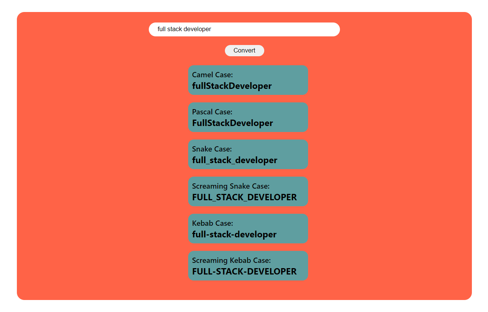

# JavaScript Project - NameConversion

## **Project: NameConversion**

### Concepts learned from this project:
- Learned more about different Casing statements and string functions in JavaScript.

**Live Link :** [Deployed Link]()
>### Preview :

